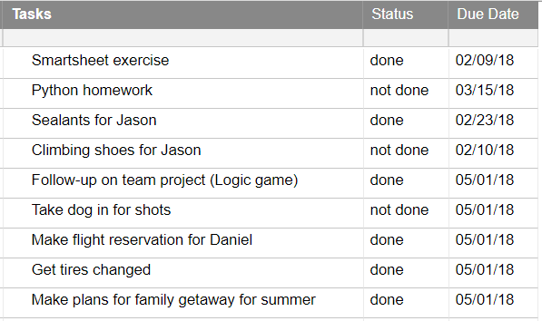

# To-do List Manager for Smartsheet
### by Diane Zevenbergen, dianezev@gmail.com
_About this web-app: The To-do List Manager uses Smartsheet's API to access and update a user's Smartsheet To-do List with a simple interface for adding, deleting and updating tasks._

## Languages/Libraries Used
  * JavaScript
  * jQuery
  * Node.js
  * Bootstrap
  * Underscore

## Requirements
1. The user's Smartsheet dashboard should include a __To-do List__ with the column titles __Tasks__, __Status__ and __Due Date__, as follows:
<p align="center">

</p>

2. The _column properties_ needed for the Smartsheet To-do-List:

    + __Status__ column properties set to _Dropdown List_ with options __not done__ and __done__.

    + __Due Date__ column properties set to _Date_.

3. A smartsheet __access token__ and a __sheet id__ for the relevant To-do List in the user's Smartsheet account. (instructions available [here](https://smartsheet-platform.github.io/api-docs/)).

4. A Node.js development environment.

5. An internet connection.

## Setup
1. Download the app from Github at [https://github.com/dianezev/practiceAPI](https://github.com/dianezev/practiceAPI).

2. Modify and save the __config.json__ file to include the user's __access token__ _(enclosed in quotes)_ and __sheet id__ _(not in quotes)_:
```
{
    "SMARTSHEET_ACCESS_TOKEN": "token_goes_here_in_quotes",
    "SHEET_ID": sheet_id_here_NO_quotes
}
```

3. Open the Node.js command prompt and navigate to the root level of the project where the __package.json__ file resides. Install Node.js modules with the following command:
```
$ npm install
```

## Running the App
1. In the Node.js command prompt and navigate to the root level of the project where the __package.json__ file resides. Start the app with the following command:
```
$ node app.js
```

2. In the browser, navigate to localhost:3001.

3. The user's Smartsheet To-do List should appear. Click on icons associated with each task to change the status, edit content or delete the task. Click on 'Add Task' to add a new item.

__Questions or Problems?__ Contact Diane Zevenbergen at dianezev@gmail.com
